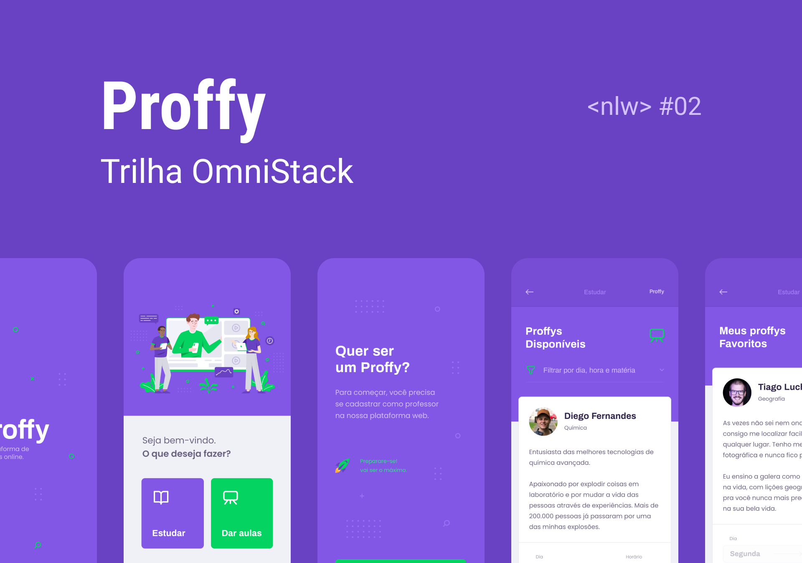

# Proffy :mortar_board:

> :books: Proffy is an online study platform to help students find new teachers :mortar_board:

  

---

  

---

> This project was build during **Next Level Week #2** promoted by [Rocketseat](https://github.com/rocketseat)

# :pushpin: Table of Contents

- [Features](#bulb-features)
- [Requirements](#construction-requirements)
- [Installation](#white_check_mark-installation)
- [Quick Start](#rocket-quick-start)
- [Technologies](#fire-technologies)
- [Layouts]('#art-layouts')
- [Contributing](#robot-contributing)
- [License](#pencil-license)

# :bulb: Features

- [x] :books: Create new classes
- [x] :mag: List classes filtering by subject, weekday and time
- [x] :heart: Save your favorite classes and teachers
- [x] :coffee: Create connections getting in touch with teachers

# :construction: Requirements

- [x] Git
- [x] Node.js
- [x] Expo CLI

# :white_check_mark: Installation

**First check if you have all the requirements above, then clone this repository:**

- Using HTTP protocol:

  - `git clone https://github.com/Yuziem14/proffy.git`

- Using SSH protocol:
  - `git clone git@github.com:Yuziem14/proffy.git`

_Obs: Only clone with SSH if you already have a safe SSH key configured._

# :rocket: Quick Start

1. **Config the server directory, to run your backend** \
    Go to the server folder using `cd server`, then:

   1. In order to install dependencies, run: `npm install`

   2. In order to config your environment variables, run: `cp .env.example .env` and setup the HOST and PORT in the .env file

   3. In order to setup the database, run: `npm run db:migrate`

   4. Finally, run your server using: `npm run dev`

2. **Config the web directory, to run your fronted** \
    Run the server and go to the web folder using `cd web`, then:

   1. In order to install dependencies, run: `npm install`

   2. In order to config your environment variables, run: `cp .env.example .env` and setup your API URL in the .env file.

   3. Finally, run your app using: `npm run start`

3. **Config the mobile directory, to run your mobile app** \
    Run the server and go to the mobile folder using `cd mobile`, then:

   1. In order to install dependencies, run: `npm install`

   2. In order to config your environment variables, run: `cp .env.example env.json` and setup your API HOST and API PORT in the env.json file.

   3. Finally, run your app using: `expo start`

_Obs: If you want, use yarn instead of npm._

# :fire: Technologies

This project was build with:

- [TypeScript](https://www.typescriptlang.org/)
- [Node.js](https://nodejs.org/en/) + [Express.js](http://expressjs.com/)
- [React.js](https://reactjs.org/)
- [React Native](https://reactnative.dev/) + [Expo](https://expo.io/)
- [SQLite](https://sqlite.org/index.html)

# :art: Layouts

> All project layouts is located in :file_folder: [.github/layouts](https://github.com/Yuziem14/proffy/tree/master/.github/layouts)

This project design and prototype was build with [Figma](https://www.figma.com/).

You can import this files to your Figma account and modify them as you want. :pray:

# :robot: Contributing

This project is under MIT license, so feel free to contribue with this project.

# :pencil: License

Read the [License](LICENSE.md) for this project.

---

> _Made with :purple_heart: by Yuri Ziemba._
